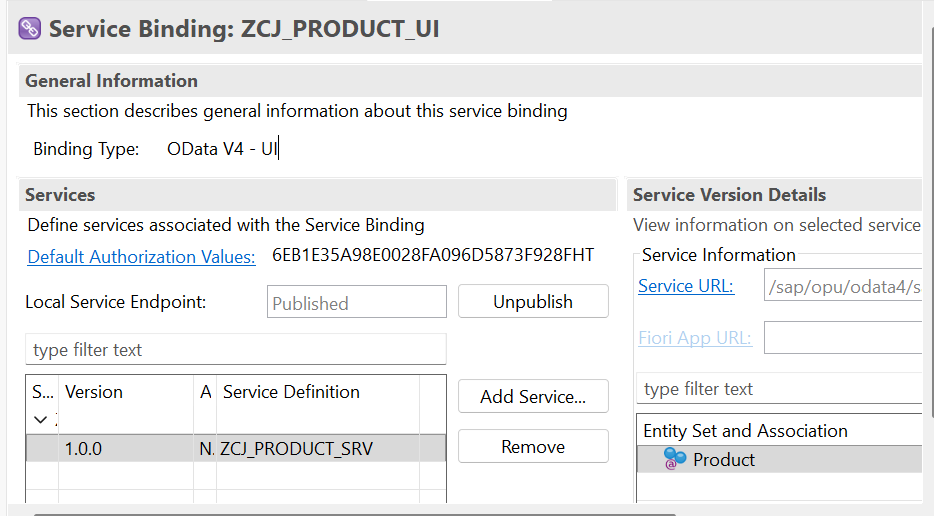
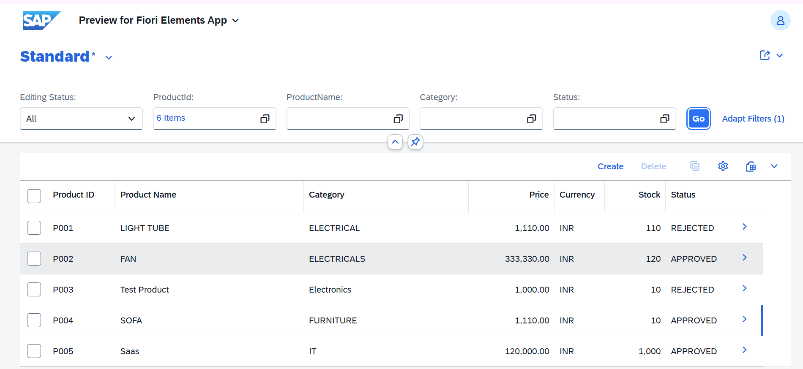
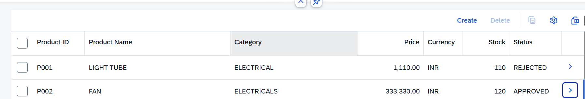
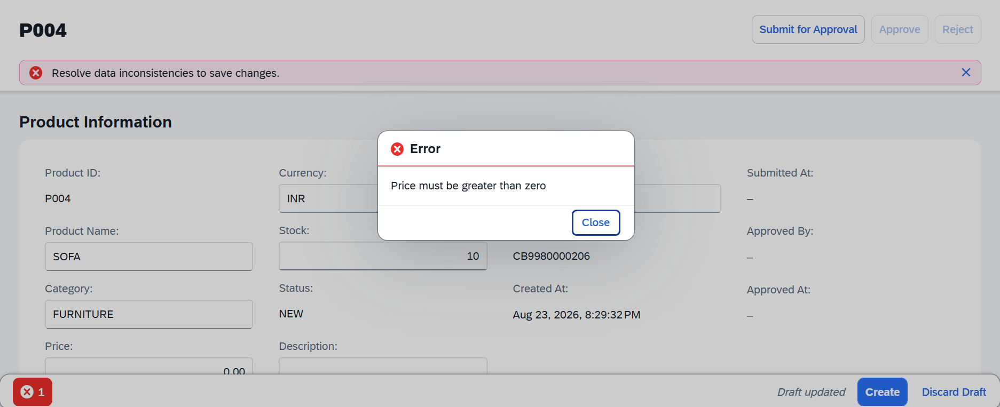
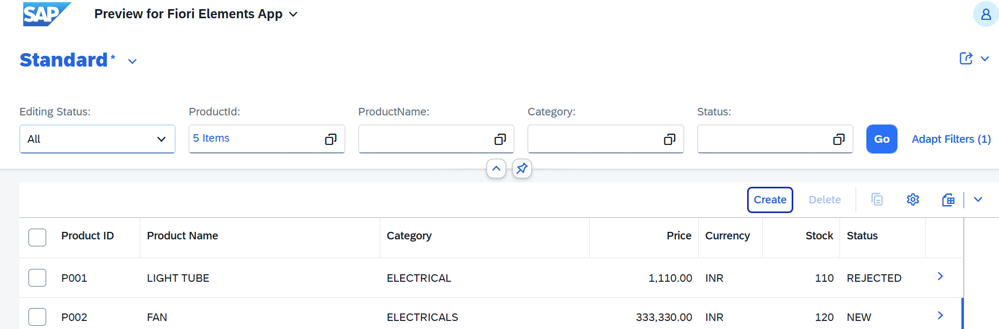
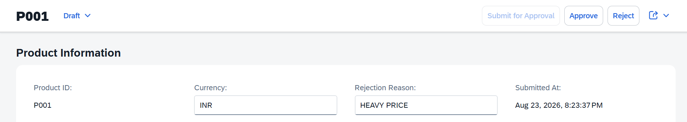
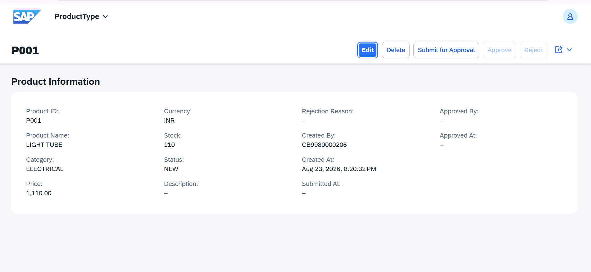

SAP RAP Product Catalog & Approval Workflow

A transactional **SAP ABAP RESTful Application Programming Model (RAP)** application for managing products through a **SAP Fiori Elements** user interface.

The application implements a complete product lifecycle with **managed RAP, draft handling, business validations, automatic creation data, and a status-driven approval workflow** using Submit, Approve, and Reject actions.

---

## 📌 Project Overview

The Product Catalog application was developed to demonstrate how a transactional business application can be built using the **SAP RAP programming model**.

The application allows users to:

- Create and maintain products
- Work with products in draft mode
- Validate product data before saving
- Submit products for approval
- Approve submitted products
- Reject products with a mandatory rejection reason
- Control available actions based on product status
- Track creation, submission, and approval information
- Access the application through a Fiori Elements UI exposed using OData V4

---

## ✨ Key Features

| Feature | Description |
|---|---|
| Product Management | Create, update, and delete products |
| Managed Draft | Edit products in draft mode before activation |
| Price Validation | Prevents products with invalid prices |
| Creation Determination | Automatically sets creator, creation timestamp, and initial status |
| Submit for Approval | Moves eligible products to `SUBMITTED` |
| Approval | Moves submitted products to `APPROVED` |
| Rejection | Moves submitted products to `REJECTED` |
| Rejection Validation | Requires a rejection reason |
| Instance Feature Control | Enables/disables actions based on product status |
| Audit Information | Tracks creation, submission, and approval details |
| Fiori Elements | Provides List Report and Object Page UI |
| OData V4 | Exposes the transactional application as a UI service |

---

# 🔄 Business Workflow

The application implements the following product approval lifecycle:

```text
                         ┌─────────────┐
                         │     NEW     │
                         └──────┬──────┘
                                │
                                │ Submit for Approval
                                ▼
                         ┌─────────────┐
                         │  SUBMITTED  │
                         └──────┬──────┘
                                │
                     ┌──────────┴──────────┐
                     │                     │
                  Approve                Reject
                     │                     │
                     ▼                     ▼
              ┌─────────────┐      ┌─────────────┐
              │  APPROVED   │      │  REJECTED   │
              └─────────────┘      └──────┬──────┘
                                           │
                                           │ Submit again
                                           ▼
                                    ┌─────────────┐
                                    │  SUBMITTED  │
                                    └─────────────┘
Status-Based Actions
Product Status	Submit	Approve	Reject
NEW	✅	❌	❌
SUBMITTED	❌	✅	✅
REJECTED	✅	❌	❌
APPROVED	❌	❌	❌

Action availability is controlled through RAP instance feature control.

🏗️ RAP Architecture
┌─────────────────────────────────────┐
│         SAP Fiori Elements          │
│      List Report / Object Page      │
└──────────────────┬──────────────────┘
                   │
                   ▼
┌─────────────────────────────────────┐
│       OData V4 UI Service Binding   │
│           ZCJ_PRODUCT_UI             │
└──────────────────┬──────────────────┘
                   │
                   ▼
┌─────────────────────────────────────┐
│          Service Definition         │
│           ZCJ_PRODUCT_SRV            │
└──────────────────┬──────────────────┘
                   │
                   ▼
┌─────────────────────────────────────┐
│       Consumption / Projection      │
│           ZCJ_C_PRODUCT              │
└──────────────────┬──────────────────┘
                   │
                   ▼
┌─────────────────────────────────────┐
│          Interface CDS View         │
│           ZCJ_I_PRODUCT              │
└──────────────────┬──────────────────┘
                   │
                   ▼
┌─────────────────────────────────────┐
│          RAP Behavior Layer         │
│                                     │
│  Behavior Definition                │
│  Behavior Projection                │
│  Behavior Implementation            │
│  Determination                      │
│  Validation                         │
│  Custom Actions                     │
│  Instance Feature Control           │
└──────────────────┬──────────────────┘
                   │
                   ▼
┌─────────────────────────────────────┐
│          Persistence Layer          │
│                                     │
│           ZCJ_PRODUCT               │
│           ZCJ_PRODUCT_D             │
└─────────────────────────────────────┘
🧩 RAP Objects
Object	Type	Purpose
ZCJ_PRODUCT	Database Table	Stores active product data
ZCJ_PRODUCT_D	Draft Table	Stores RAP draft data
ZCJ_I_PRODUCT	Root CDS View Entity	Interface/root business object
ZCJ_C_PRODUCT	Projection CDS View	Service-facing projection
ZBP_CJ_I_PRODUCT	Behavior Implementation	Implements RAP business logic
ZCJ_PRODUCT_SRV	Service Definition	Exposes the Product entity
ZCJ_PRODUCT_UI	Service Binding	Publishes the OData V4 UI service
Metadata Extension	UI Metadata	Defines Fiori Elements presentation
📦 Product Data Model

The Product entity contains the following information:

Product Information
Product ID
Product Name
Description
Category
Price
Currency
Stock
Workflow Information
Status
Rejection Reason
Submitted At
Approved By
Approved At
Audit Information
Created By
Created At
Last Changed At
⚙️ RAP Behavior Implementation
Standard Operations

The managed RAP business object supports:

Create
Update
Delete
Managed Draft

The application uses managed draft to allow users to work with an editable version of a product before activating it.

Draft-related operations include:

Edit
Activate
Discard
Resume
Prepare

This allows users to modify product information without immediately changing the active business object.

🧠 Business Logic
1. Creation Determination

The setCreationData determination runs during product creation.

It automatically initializes:

CreatedBy
CreatedAt
Status = NEW

The creator is obtained using the ABAP runtime context and the creation timestamp is generated at runtime.

2. Price Validation

The validateProduct validation runs during save for create/update operations.

The application rejects invalid prices:

Price <= 0

with the message:

Price must be greater than zero

This prevents invalid product information from being saved.

3. Submit for Approval

The submitForApproval action can be executed when the product is:

NEW
REJECTED

The action updates:

Status      = SUBMITTED
SubmittedAt = current timestamp
4. Approval

The approve action is available only for:

Status = SUBMITTED

On successful approval:

Status     = APPROVED
ApprovedBy = current user
ApprovedAt = current timestamp
5. Rejection

The reject action is available only for:

Status = SUBMITTED

A rejection requires a rejection reason.

If no reason is supplied, the application displays:

Rejection reason is required.

After successful rejection:

Status = REJECTED

The rejection reason is retained.

🎛️ Instance Feature Control

The application uses RAP instance feature control to dynamically control the availability of workflow actions.

The implementation determines the available actions based on the current product status.

For example:

NEW
 └── Submit for Approval enabled

SUBMITTED
 ├── Approve enabled
 └── Reject enabled

REJECTED
 └── Submit for Approval enabled

APPROVED
 └── No workflow action enabled

This prevents users from executing workflow operations that are not valid for the current business state.

🔗 EML Usage

The behavior implementation uses Entity Manipulation Language (EML) for transactional access to the RAP business object.

Examples used in the project include:

READ ENTITIES

and:

MODIFY ENTITIES

These are used for reading and modifying RAP entities within the behavior implementation while respecting the RAP transactional model.

🖥️ Fiori Elements UI

The application is exposed through an OData V4 UI service and consumed using SAP Fiori Elements.

The UI provides:

List Report

The List Report displays the product catalog with fields such as:

Product ID
Product Name
Category
Price
Currency
Stock
Status
Object Page

The Object Page provides detailed product information and workflow actions.

The UI metadata is maintained through a CDS metadata extension.

## Screenshots

### Service Binding



### Product List



### Product Statuses



### Price Validation



### Draft / Edit



### Submitted Product


### Rejection Validation



### Rejected Product


### Product Object Page



## Technologies

- SAP ABAP
- ABAP RESTful Application Programming Model (RAP)
- CDS
- ABAP Behavior Definition
- ABAP Behavior Implementation
- OData V4
- SAP Fiori Elements
- Eclipse / ABAP Development Tools (ADT)

🗂️ Repository Structure
SAP-RAP-Product-Catalog/
│
├── README.md
├── SOURCE_OBJECTS.md
├── .gitignore
│
├── screenshots/
│   ├── 01-service-binding.png
│   ├── 02-product-list.png
│   ├── 03-price-validation.png
│   ├── 04-product-list-statuses.png
│   ├── 05-draft-edit.png
│   ├── 06-product-rejected.png
│   ├── 07-rejection-validation.png
│   ├── 08-product-list-after-workflow.png
│   ├── 09-submitted-product.png
│   ├── 10-product-object-page.png
│   └── 11-product-edit-draft.png
│
└── src/
    │
    ├── database/
    │   ├── zcj_product.ddl
    │   └── zcj_product_d.ddl
    │
    ├── cds/
    │   ├── zcj_i_product.ddl
    │   └── zcj_c_product.ddl
    │
    ├── behavior/
    │   ├── zcj_i_product.bdef
    │   ├── zcj_c_product.bdef
    │   └── zbp_cj_i_product.abap
    │
    ├── metadata/
    │   └── zcj_c_product.mde
    │
    └── service/
        └── zcj_product_srv.srvd
🛠️ Technologies
Technology	Usage
SAP ABAP	Application and behavior implementation
ABAP RAP	Transactional business object
CDS	Data modeling and service projection
OData V4	Service exposure
Fiori Elements	User interface
ADT / Eclipse	Development environment
📚 RAP Concepts Demonstrated

This project provides practical implementation of:

Root CDS View Entities
Projection CDS View
Managed RAP Business Object
Managed Draft
Behavior Definition
Behavior Projection
Behavior Implementation
Determination
Validation
Instance Feature Control
Custom Actions
Entity Manipulation Language (EML)
Transactional Query Provider Contract
OData V4 Service Definition
OData V4 UI Service Binding
Fiori Elements
CDS Metadata Extensions
ETag / Last-Changed Handling
🔐 Authorization

The current implementation intentionally uses simple authorization settings suitable for the development/trial implementation.

Role-based authorization has not been implemented yet.

A production-oriented version could introduce separate requester and approver roles with appropriate authorization checks.

🚀 Future Enhancements

Possible extensions include:

Role-based authorization
Separate requester and approver roles
Approval notifications
Email notifications
Additional product validations
Category and currency value helps
Search and filtering enhancements
Product analytics and reporting
Additional workflow states
SAP BTP deployment and configuration documentation
🎯 Project Outcome

The application demonstrates a complete transactional product lifecycle using SAP RAP:

Create
   ↓
Draft
   ↓
Validate
   ↓
Submit for Approval
   ↓
┌───────────────┐
│               │
Approve       Reject
│               │
▼               ▼
APPROVED      REJECTED
                │
                │ Submit Again
                ▼
             SUBMITTED

The project demonstrates how RAP behavior, CDS data modeling, EML, draft handling, validations, determinations, instance feature control, OData V4, and Fiori Elements can be combined to build a transactional SAP application.

📌 Project Status

Completed — Functional Prototype

The current implementation has been tested through the complete product workflow, including:

Product creation
Draft editing
Price validation
Submission
Approval
Rejection
Rejection validation
Status-based action control
Fiori Elements UI interaction
👨‍💻 Repository

GitHub:
https://github.com/kamalsrikanta/SAP-RAP-Product-Catalog


